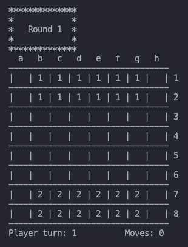
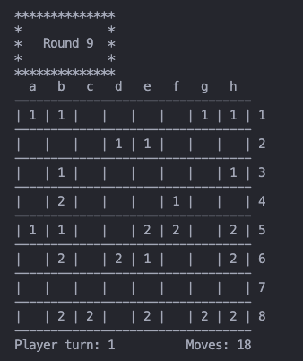
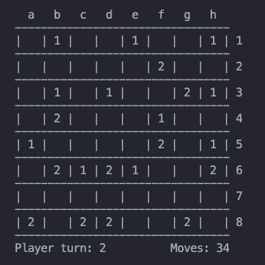

# Apart

### Turma 01 - Grupo Apart_4

Henrique Gonçalves Graveto Futuro da Silva - up202105647@up.pt <br>
Contribuição: **50%**

Rita Isabel Guedes Correia Leite - up202105309@up.pt <br>
Contribuição: **50%**

# Instalação e Execução

Para instalar este jogo, o utilizador necessita de instalar a pasta zip chamada `PFL_TP1_T01_Apart_4.zip`, descomprimir os ficheiros e entrar na pasta `src`. Aqui dentro, é necessário consultar o ficheiro `main.pl`. Para fazer isto, o utilizador pode utlizar a UI fornecida pelo SICSTUS ou escrever o seguinte da linha de comandos:

```sh
$ sicstus
?-  consult('main.pl').
```

_Nota_: É necessário ter instalado o SICStus Prolog 4.8 ou uma versão mais recente.

Para executar o jogo basta chamar o predicado `play/0` da seguinte forma

```sh
?-  play.
```

# Descrição do jogo

Apart é um jogo de tabuleiro para dois jogadores. É jogado num tabuleiro quadrado de 8x8 e cada jogador tem ao seu dispor 12 peças. Para distinguir as peças de ambos os jogadores, estas encontram-se com cores diferentes.

No início do jogo, as peças têm uma posição pré-determinada, formando um grupo de 6x2. O objetivo deste jogo é distribuir as peças pelo tabuleiro. Para isso, o jogador pode mover as peças pelo tabuleiro.

Definições:

- Uma linha (vertical, horizontal ou diagonal) de peças da mesma cor é chamada **line**.
- Uma linha com uma peça é considerada uma **line** de tamanho 1.
- Mover uma peça para um lugar adjacente é designado por **single step**, e mover para um lugar afastado por dois ou mais quadrados é designado por **jump**.
- Realizar um **jump** mais do que uma vez numa jogada é designado por **continuous jump**.

Regras:

- O jogo começa com o jogador que tiver as peças brancas.
- Uma peça só pode ser movida por jogada.
- A primeira jogada do jogo não pode conter um **continuous jump**.
- Uma peça pode ser movida ao longo de uma linha a que pertença, desde que a distância percorrida pela peça seja igual ao tamanho dessa linha.
- A peça pode saltar por peças que se encontram a meio do caminho e, se tiver uma peça inimiga onde 'aterrar', a peça inimiga é capturada e removida do jogo.
- Peças não podem ser movidas para um lugar onde já esteja uma peça da mesma cor.
- Se a peça conseguir realizar um **jump** no lugar onde aterrou, pode continuar a mover-se na mesma jogada, embora não seja obrigatório (**continuous jump**).
- Não há um limite de **jumps** que uma peça possa realizar num **continuous jump**.
- Um quadrado só pode ser utilizado uma vez por jogada.
- Um **single step** não pode ser incluído num **continuous jump**.

O jogo acaba quando todas as peças de um jogador não tiverem uma peça da mesma cor adjacentes (verticalmente, horizontalemente e diagonalmente) à mesma.
Se ambos os jogadores chegarem a este estado ao mesmo tempo, o jogador que fez a última jogada perde.

As regras e o funcionamento do jogo foram consultados nos seguintes sites:

- https://kanare-abstract.com/en/pages/apart
- https://cdn.shopify.com/s/files/1/0578/3502/8664/files/Apart_EN.pdf?v=1682248406

# Lógica do jogo

O código do jogo está organizado em diferentes ficheiros, de acordo com o seu propósito. Estes podem ser encontrados na pasta `src`.

Abaixo apresentamos o propósito de cada um:

| Nome do Ficheiro  | Descrição                                                                                    |
| :---------------: | -------------------------------------------------------------------------------------------- |
|      `board`      | Contém os predicados que criam e imprimem o tabuleiro                                        |
| `check_isolation` | Contém os predicados que verificam os niveis de isolamento de uma peça                       |
|   `check_move`    | Contém os predicados que verificam se o movimento é possivel de acordo com as regras do jogo |
|    `check_win`    | Contém os predicados que verificam se um jogador ganhou ou não                               |
|    `distance`     | Contém os predicados que calculam os tamanhos das linhas onde uma peça está inserida         |
|      `menu`       | Contém os menus do jogo                                                                      |
|      `move`       | Contém os predicados relacionados com a movimentação das peças                               |
|      `piece`      | Contém os predicados relacionados com uma peça                                               |
|      `state`      | Contém os estados do jogo                                                                    |
|      `utils`      | Contém predicados de utilidade                                                               |
|      `main`       | Contém o predicado play                                                                      |

### Representação interna do estado do jogo

O estado interno do jogo é guardado numa variável chamada `GameState`. Esta variável é composta pelo tabuleiro, jogador atual e número total de movimentações realizadas.

- **Tabuleiro**

O tabuleiro é representado como uma matriz, isto é, uma lista com sublistas. Cada sublista representa uma linha do tabuleiro e cada elemento dentro de cada sublista representa um quadrado do tabuleiro.

Neste quadrado, podemos ter três valores possíveis, `0`, `1` ou `2`.

- `0` representa um quadrado vazio.
- `1` representa uma peça do jogador 1.
- `2` representa uma peça do jogador 2.

Estado inicial de um tabuleiro 8x8:



Estado intermédio de um tabuleiro 8x8:



Estado final de um tabuleiro 8x8:



- **Jogador atual**

O jogador atual é representado através da variável `Turn`.

No final de cada ronda, o jogador atual é trocado utilizando o seguinte predicado `change_player(?Player1,?Player2)`.

```prolog
change_player(1,2).
change_player(2,1).
```

- **Número total de movimentações realizados**

O número total de movimentações realizados é representado pela variável `TotalMoves` e é meramente uma informação adicional representada quando se dá display do board.

### Visualização do estado do jogo

- ### Menu do Modo de Jogo

O predicado usado para criar o menu que define o modo de jogo chama-se `menu_game_mode(-Option)`.

Abaixo é possivel ver a representação deste menu na consola.

```prolog
---------------------------------------------
|              MENU GAME MODE               |
| Select the mode in which you want to play |
| 1: Person vs Person                       |
| 2: Person vs Easy AI                      |
| 3: Easy AI vs Person                      |
| 4: Easy AI vs Easy AI                     |
| 5: Person vs Difficult AI                 |
| 6: Difficult AI vs Person                 |
| 7: Easy AI vs Difficult AI                |
| 8: Difficult AI vs Easy AI                |
| 9: Difficult AI vs Difficult AI           |
---------------------------------------------
Select the number of the option:
```

- ### Tabuleiro

O tabuleiro do jogo é imprimido sempre antes de haver uma movimentação de peças, podendo este ser qualquer tamanho de altura ou largura, desde que esteja compreendido entre 5 e 15.

Devido a esta possivel variação de tamanhos, é preciso defini-los no início do jogo, usando o seguinte predicado `initial_state(-GameState)`. Este utiliza outros predicados como: `read_size_board(-Height,-Width)`, que lê a altura e largura definidas pelo jogador, e `make_initial_board(+Height,+Width,-Board)`, que cria o tabuleiro com as especificações obtidas.

```prolog
initial_state((Board,Turn,TotalMoves)) :-
    TotalMoves is 0,
    Turn is 1,
    read_size_board(Height,Width),
    make_initial_board(Height,Width,Board), nl.
```

Depois de passar esta primeira fase, e usando o predicado `display_game(+GameState)`, é possivel obter a seguinte representação do tabuleiro 5x5, caso forem essas as medidas definidas.

```prolog
  a   b   c   d   e
---------------------
|   | 1 | 1 | 1 |   | 1
---------------------
|   | 1 | 1 | 1 |   | 2
---------------------
|   |   |   |   |   | 3
---------------------
|   | 2 | 2 | 2 |   | 4
---------------------
|   | 2 | 2 | 2 |   | 5
---------------------
```

É importante referir ainda que a variavel `Board`, que é a matriz que representa o tabuleiro, é composta por `1` e `2`, dependendo do jogador. As casas vazias, que na matrix são representadas com `0`, são apresentadas como um espaço vazio, `' '`.

- ### Menu de Continuous Jump

Caso o jogador tenha feito um jump, e se na nova posição onde se encontra a peça é possivel fazer outro, então o sistema tem de lhe perguntar se este deseja ou não fazê-lo.

Para isto, é usado um menu que aparece depois de o sistema verificar que esta ação é possivel, estando abaixo a sua representação.

O predicado usado chama-se `menu_jump_cycle(-Option,+Type)`, sendo o `Type` o modo do jogador, que pode ser "pessoa" (simbolizado com `1`), "easy ai" (simbolizado com `2`) ou "difficult ai" (simbolizado com `3`). Este parâmetro é importante uma vez que este menu só é representado no modo `1`.

```prolog
------------------------------------
|       MENU CONTINUOUS JUMP       |
| Do you want to continue jumping? |
| 1: Yes                           |
| 2: No                            |
------------------------------------
Select the number of the option:
```

### Validação de jogadas e execução

Para uma jogada ser validada é necessário obter as distâncias que a peça que vai ser movida pode percorrer. Isto pode ser obtido através do predicado `calculate_distances(+X,+Y,+GameState,-Distances)` que, dado uma peça, vai calcular a distância que ela pode percorrer na vertical, horizontal e nas diagonais.

```prolog
calculate_distances(X,Y,GameState,Distances) :-
    row_distance(X,Y,GameState,RowDistance),
    column_distance(X,Y,GameState,ColumnDistance),
    diagonal_distance_NESW(X,Y,GameState,NESWDiagonalDistance), % ↙↗
    diagonal_distance_NWSE(X,Y,GameState,NWSEDiagonalDistance), % ↖↘
    append([ColumnDistance],[RowDistance],DistancesAux),
    append([NESWDiagonalDistance],[NWSEDiagonalDistance],DistancesAux2),
    append(DistancesAux,DistancesAux2,Distances).
```

Após obter as distâncias que uma peça pode percorrer é verificado se as novas coordenadas da peça se encontram dentro da Board e se a nova posição não é ocupada por uma peça da mesma equipa. Para isto, é utilizado o predicao `get_position_player(+X,+Y,+GameState)`.

```prolog
get_position_player(X,Y,(Board,Player,_)) :-
    check_inside_board(X,Y,(Board,_,_)),
    get_position_piece(X,Y,Board,Piece),
    Piece is Player.
```

_Nota:_ Este predicado retorna true se nas coordenadas `X` e `Y` se encontra uma peça da equipa do `Player`. Como queremos o oposto, quando utilizamos este predicado precisamos de o negar da seguinte maneira `\+get_position_player(+X,+Y,+GameState)`.

Após se verificar que as novas coordenadas não possuem nenhum problema, é verificado se a peça original consegue chegar a estas coordenadas utilizando uma distância possível. Para tal, é usado o predicado `check_move_possible(+XP,+YP,+XM,+YM,+GameState)` que utiliza o predicado `check_move(+XP,+YP,+XM,+YM,+Distances)` para verificar as distâncias individualmente.

```prolog
check_move_possible(XP,YP,XM,YM,GameState):-
    calculate_distances(XP,YP,GameState,Distances),
    check_move(XP,YP,XM,YM,Distances),
    !.
```

```prolog
/* horizontal */
check_move(XP,YP,XM,YM,Distances) :-
    YP is YM,
    nth1(2,Distances,Value),
    (XM is XP-Value; XM is XP+Value),
    !.
```

_Nota:_ Aqui apenas está representado o `check_move/5` para a horizontal, no código também está presente para a vertical e as diagonais.

Após uma jogada ser validada, ela é executada através do predicado `move(+GameState,+Move,-NewGameState)`. Este predicado vai substituir a peça que se encontra na posição inicial por um `0` e vai colocar o valor da peça (`1` caso seja o jogador 1 ou `2` caso seja o jogador 2) na nova posição.

```prolog
move((Board,Turn,TotalMoves),(XP,YP,XM,YM),(NewBoard,Turn,NewTotalMoves)) :-
    change_piece(0,Board,XP,YP,TempBoard),
    change_piece(Turn,TempBoard,XM,YM,NewBoard),
    NewTotalMoves is TotalMoves+1.
```

Agora que a peça já se encontra na sua nova posição, é necessário verificar se ela consegue realizar um continuous jump utilizando o predicado `check_continuous_jump_cycle(+Move,+GameState,-NewGameState,+VisitedPositions,+Type)`.

```prolog
check_continuous_jump_cycle((XP,YP,XM,YM),(Board,Turn,TotalMoves),NewGameState,VisitedPositions,Type) :-
    \+no_jump(XP,YP,XM,YM),
    change_player(Turn,NewTurn),
    (
        \+check_winner(Board,1,Turn),
        \+check_winner(Board,1,NewTurn)
    ),
    append(VisitedPositions,[[XM,YM]],NewVisitedPositions),
    valid_moves((Board,Turn,TotalMoves),VisitedPositions,ListOfMoves),
    board_size(Height,Width,(Board,Turn,TotalMoves)),
    findall(
        [NXM,NYM],
        (
            between(1, Width, NXM),
            between(1, Height, NYM),
            member([XM,YM,NXM,NYM],ListOfMoves),
            \+no_jump(XM,YM,NXM,NYM)
        ),
        Result
    ),
    length(Result,Size),
    Size>0,
    !,
    do_continuous_jump_cycle((Board,Turn,TotalMoves),NewGameState,NewVisitedPositions,Type).
```

Este predicado verifica se a última move foi um jump negando o predicado `no_jump(+XP,+YP,+XM,+YM)` e verifica se é possível realizar um jump através da utilização do `findall/3`. Se tudo for verificado, o continuous jump é realizado no predicado `do_continuous_jump_cycle(+GameState,-NewGameState,+VisitedPositions,+Type)`.

Para finalizar, como a primeria jogada do jogo não pode conter uma continuous jump, no `game_cicle/3` não verificamos se tal movimento é possível.

```prolog
/* na primeira jogada não é possivel fazer continuous jump */
game_cycle((Board,Turn,0),Mode,Round):-
    player_type(Mode,Turn,Type),
    choose_move( (Board,Turn,0), [], Type, Move),
    move((Board,Turn,0),Move,(NewBoard,_,NewTotalMoves)),
    change_player(Turn,NewTurn),
    change_round(NewTurn,Round,NewRound),
    display_game_with_round((NewBoard,NewTurn,NewTotalMoves),NewRound),
    !,
    game_cycle((NewBoard,NewTurn,NewTotalMoves),Mode,NewRound).


game_cycle((Board,Turn,TotalMoves),Mode,Round):-
    player_type(Mode,Turn,Type),
    choose_move((Board,Turn,_), [], Type, (XP,YP,XM,YM)),
    move((Board,Turn,TotalMoves),(XP,YP,XM,YM),TempGameState),
    append([[XP,YP]],[],VisitedPositions),
    check_continuous_jump_cycle((XP,YP,XM,YM),TempGameState,(NewBoard,_,NewTotalMoves),VisitedPositions,Type),
    change_player(Turn,NewTurn),
    change_round(NewTurn,Round,NewRound),
    display_game_with_round((NewBoard,NewTurn,NewTotalMoves),NewRound),
    !,
    game_cycle((NewBoard,NewTurn,NewTotalMoves),Mode,NewRound).
```

### Lista de jogadas válidas

Para se obter uma lista com as jogadas válidas podemos utilizar o predicado `valid_moves(+GameState,+Player,-ListOfMoves)` que utiliza o predicado `findall/3`. Este predicado obtém todas as peças da equipa do jogador e faz todas as jogadas possíveis.

```prolog
valid_moves(GameState,VisitedPositions,ListOfMoves) :-
    board_size(Height,Width,GameState),
    findall(
        [XP,YP],
        (
            between(1, Width, XP), between(1, Height, YP),
            get_position_player(XP,YP,GameState)
        ),
        PlayerPiece
    ),
    findall(
        [XP,YP,XM,YM],
        (
            between(1, Width, XM), between(1, Height, YM),
            member([XP,YP],PlayerPiece),
            \+get_position_player(XM,YM,GameState),
            check_move_possible(XP,YP,XM,YM,GameState),
            \+member([XM,YM],VisitedPositions)
        ),
        ListOfMoves
    ).
```

O primeiro `findall/3` obtém a posição de todas as peças do jogador que está a jogar e o segundo `findall/3` obtém todas as combinações possíveis através do `check_move_possible(XP,YP,XM,YM,GameState)`. É necessário ainda salientar o `\+get_position_player(XM,YM,GameState)` que impede que uma peça se desloque para uma casa ocupada por uma peça da sua equipa e ainda o `\+member([XM,YM],VisitedPositions)` que impede a realização de uma jogada para uma casa que já foi visitada no turno do jogador (necessário para os continuous jumps).

### Final do jogo

O predicado `game_over(+GameState,-Winner)` verifica se algum dos jogadores já ganhou, usando para isso o predicado `check_winner(+Board,+Y,+Player)` que percorre o tabuleiro todo e verifica se as peças do jogador definido em player estão isoladas.

É importante notar que esta verificação é feita antes de um jogador jogar, e havendo a regra de que caso um jogador faça um movimento que faz com que ambos sejam vencedores, este acaba por ser o perdedor, e por isso `game_over/2` é definido da seguinte forma:

```prolog
game_over((Board,Turn,_),Winner) :-
    change_player(Turn,NewTurn),
    Y is 1,
    \+check_winner(Board,Y,Turn),
    !,
    check_winner(Board,Y,NewTurn),
    Winner is NewTurn.

game_over((_,Turn,_),Turn).
```

Caso seja verificado que a partida chegou ao fim e que um dos jogadores foi o vencedor, é perguntado ao utilizador se quer ou não fazer outro jogo, através do seguinte menu:

```
------------------------------------
|        MENU RESTART GAME         |
| Do you want to play again?       |
| 1: Yes                           |
| 2: No                            |
------------------------------------
```

Caso ele escolha a opção `Yes`, então é representado outra vez o menu dos modos de jogo, para ele poder voltar a jogar.

Se escolher `No` o programa termina.

### Avaliação do estado do jogo

O predicado `value(+GameState, +Player, -Value)` avalia o tabuleiro de jogo.

Como já foi referido antes, o jogo acaba quando um dos jogadores ganha, no entanto caso o jogador faça um movimento vencedor para ambos os lados, é o seu adversário quem ganha. Para além disso, a posição das peças de um jogador não tem o "poder" de bloquear um possivel movimento do adversário.

Desta forma, é importante que o jogador esteja atento e veja que resultado gerará a sua jogada, ou seja, se causará ou não, a vitória do seu adversário.

Optamos assim por avaliar o tabuleiro da seguinte forma:

- se for verificado que o oponente ganhou, este vale 0 pontos;
- se for verificado que o jogador ganhou, este vale 10 pontos;
- se ninguém ganhar, vale 5.

```prolog
value((Board,Turn,_),Value) :-
    change_player(Turn,NewTurn),
    check_winner(Board,1,NewTurn),
    !,
    Value is 0.

value((Board,Turn,_),Value) :-
    check_winner(Board,1,Turn),
    !,
    Value is 10.

value(_,Value) :- Value is 5.
```

### Jogada do computador

Este jogo possui dois tipos de jogadas por computador. O primeiro tipo, `Easy AI`, é baseado em aleatoriedade, onde o computador seleciona a peça que vai mover, bem como a jogada a fazer, de forma totalmente aleatória. Caso haja a hipótese de realizar um continuous jump, o computador vai gerar um número aleatório entre `1` e `2` e, caso o número gerado seja 1, o computador realiza o continuous jump.

```prolog
% modo Easy AI, sem continuous jump
choose_move(GameState,VisitedPositions,2,(XP,YP,XM,YM)) :-
    length(VisitedPositions,Size),
    Size is 0,

    valid_moves(GameState,VisitedPositions,ListOfMoves),
    length(ListOfMoves,MaxIndex),
    MaxIndexRandom is MaxIndex+1,
    random(1,MaxIndexRandom,Index),
    nth1(Index,ListOfMoves,Move),

    nth1(1,Move,XP),
    nth1(2,Move,YP),
    nth1(3,Move,XM),
    nth1(4,Move,YM),
    !.
```

O segundo tipo, `Difficult AI`, utiliza um algorítmo greedy. Este algorítmo vai selecionar a peça menos isolada da equipa do jogador e vai escolher a jogada que isole melhor esta peça. Para selecionar a peça menos isolada, é calculado o isolamento de cada peça individualmente utilizando o predicado `get_piece_isolation(+X,+Y,-Value,+GameState,+Bool)`. Este predicado calcula quantas peças da própria equipa uma peça tem à sua volta. Caso haja mais do que uma peça com o menor nível de isolamente, o algorítmo seleciona uma de forma aleatória.

Agora que o computador tem uma peça selecionada, o algorítmo vai calcular o nível de isolamento para cada jogada possível que aquela peça pode realizar e vai selecionar a jogada que isole mais a peça. Se houver mais do que uma jogada com o melhor nível de isolamento, o algorítmo seleciona uma de forma aleatória.

Para decidir se o algorítmo faz um continuous jump, este verifica se o nível de isolamente após o continuous jump é melhor ou pior do que o nível de isolamento atual. Se for pior, o continuous jump não é realizado.

```prolog
% modo Difficult AI, sem continuous jump
choose_move(GameState,VisitedPositions,3,(XP,YP,XM,YM)) :-
    length(VisitedPositions,Size),
    Size is 0,

    valid_moves(GameState,VisitedPositions,ListOfMoves),
    board_size(Height,Width,GameState),
    findall(
        [Value,XPT,YPT,XMT,YMT],
        (
            between(1, Width, XPT), between(1, Height, YPT),
            between(1, Width, XMT), between(1, Height, YMT),
            member([XPT,YPT,XMT,YMT],ListOfMoves),
            get_piece_isolation(XPT,YPT,Value,GameState,0),
            best_piece_move(GameState,XPT,YPT,XMT,YMT)
        ),
        Result
    ),

    sort(Result, SortedResult),
    length(SortedResult,MaxIndex),

    nth1(MaxIndex,SortedResult,Elem),
    nth1(1,Elem,MaxValue),

    findall(
        [BoardValue,Value,XPT,YPT,XMT,YMT],
        (
            member([Value,XPT,YPT,XMT,YMT],Result),
            Value is MaxValue,
            value(GameState,BoardValue)
        ),
        BestMoves
    ),
    sort(BestMoves,ValueBestMoves),
    length(ValueBestMoves,NumberMoves),

    nth1(NumberMoves,ValueBestMoves,ValueElem),
    nth1(1,ValueElem,BestPlayValue),

    findall(
        [BoardValue,Value,XPT,YPT,XMT,YMT],
        (
            member([BoardValue,Value,XPT,YPT,XMT,YMT],BestMoves),
            BoardValue is BestPlayValue
        ),
        FinalMoves
    ),

    length(FinalMoves,Index),
    UpdatedIndex is Index+1,
    random(1,UpdatedIndex,Final),

    nth1(Final,FinalMoves,SelectedMove),
    nth1(3,SelectedMove,XP),
    nth1(4,SelectedMove,YP),
    nth1(5,SelectedMove,XM),
    nth1(6,SelectedMove,YM).
```

# Conclusões

A nivel geral o jogo Apart foi implementado com sucesso, tendo-se criado os modos Pessoa vs Pessoa, Pessoa vs Computador e Computador vs Computador, podendo-se ainda escolher entre um modo fácil ou dificil.

Uma das regras do jogo é que quando uma peça faz um "salto" e chega a uma casa onde pode tornar a fazê-lo, tem a oportunidade de o fazer ou não.

No entanto, no modo dificil do computador, quando se verifica se o salto irá trazer benefícios a nivel do isolamento da peça, não se vê se essa movimentação irá provocar a vitória do adversário, ao contrário do que é feito na escolha do movimento inicial.

Podemos assim concluir que este projeto foi importante para aumentarmos o nosso conhecimento em Prolog, havendo ainda espaço para melhorias.

# Bibliografia

Durante a execução do trabalho, foram consultados os seguintes sites para obter informação sobre o jogo:

- https://kanare-abstract.com/en/pages/apart
- https://cdn.shopify.com/s/files/1/0578/3502/8664/files/Apart_EN.pdf?v=1682248406
